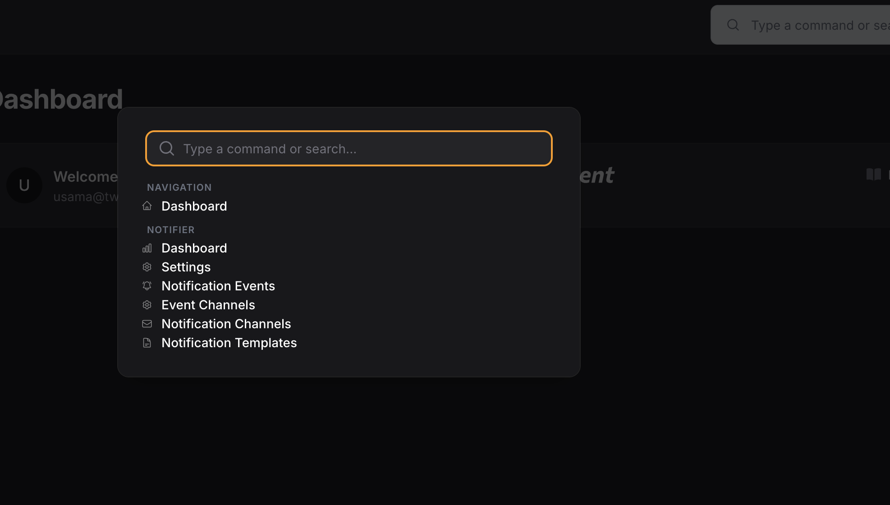

# Filament Palette

[](https://packagist.org/packages/xuanpablo/filament-palette)
[](https://packagist.org/packages/xuanpablo/filament-palette)
[](https://github.com/xuanpablo/filament-palette/blob/HEAD/LICENSE.md)


A Spotlight/CMD+K style command palette for quick navigation and actions across Filament panels.

## Features

- **Keyboard shortcut**: Press `Cmd+K` (Mac) or `Ctrl+K` (Windows/Linux) to open
- **Quick navigation**: Jump to any page, resource, or navigation item
- **Search**: Filter commands by typing
- **Keyboard navigation**: Use arrow keys and Enter to select
- **Optional topbar button**: Click to open from the topbar

## Installation

```bash
composer require xuanpablo/filament-palette
```

## Setup

Register the plugin in your Filament panel provider:

```php
use Xuanpablo\FilamentPalette\FilamentPalettePlugin;

public function panel(Panel $panel): Panel
{
    return $panel
        ->plugins([
            FilamentPalettePlugin::make(),
            // ...
        ]);
}
```

## Configuration

Publish the config file (optional):

```bash
php artisan vendor:publish --tag=filament-palette-config
```

Options in `config/filament-palette.php`:

- `key_bindings`: Keyboard shortcuts (default: `['mod+k']`)
- `show_topbar_button`: Show optional trigger in topbar (default: `true`)
- `max_results`: Max results per category (default: `10`)
- `include_publish_views_command`: Show "Publish views" in the command palette (default: `true`)
- `custom_commands`: Array of closures returning `CommandItem[]` for extensibility

## Publishing Views

You can publish the package views to customize the command palette layout, styling, and behavior. Published views go to `resources/views/vendor/filament-palette/` and can be edited freely.

**From the command palette:** Open the palette (Cmd+K), search for "Publish views", and select it to open a page with a one-click publish button.

**From the terminal:**

```bash
php artisan filament-palette:publish-views
```

Or using Laravel's vendor publish directly:

```bash
php artisan vendor:publish --tag=filament-palette-views
```

Use `--force` to overwrite existing published views.

## Custom Commands

Add custom commands via config:

```php
'custom_commands' => [
    fn () => [
        \Xuanpablo\FilamentPalette\Support\CommandItem::make(
            'My Action',
            '/my-url',
            'Custom',
        ),
    ],
],
```

## Requirements

- PHP 8.4+
- Filament v4 or v5
- Laravel 11 or 12

## Screenshots 
<p align="center">
  
</p>


## License

MIT
