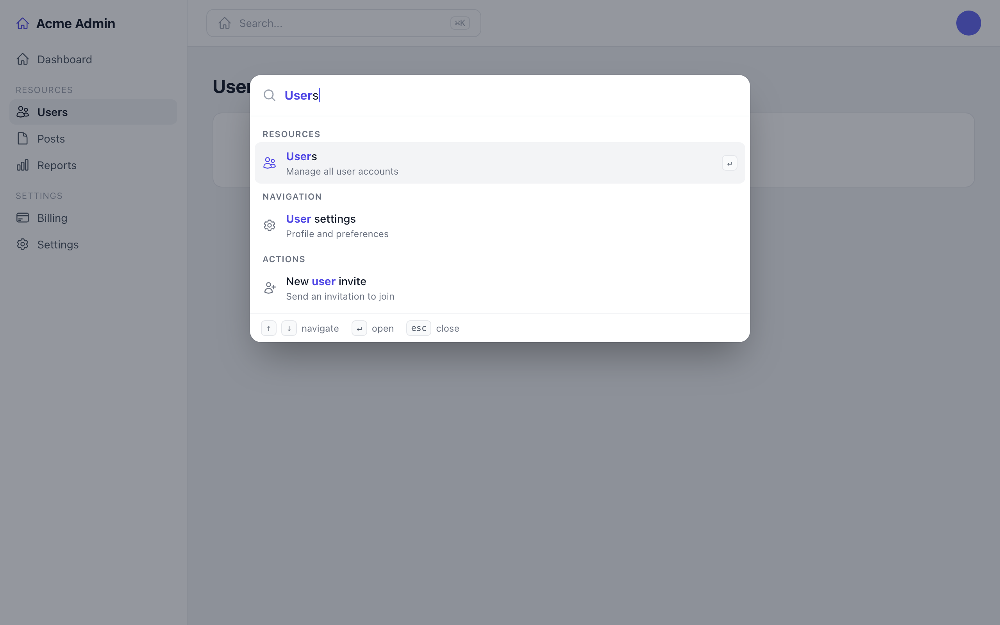
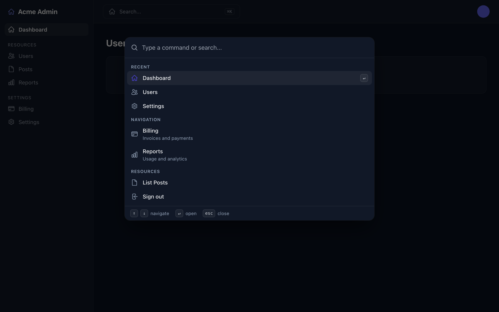

# Filament Palette

[](https://packagist.org/packages/xuanpablo/filament-palette)
[](https://packagist.org/packages/xuanpablo/filament-palette)
[](https://github.com/xuanpablo/filament-palette/blob/HEAD/LICENSE.md)



A Spotlight/CMD+K style command palette for quick navigation and actions across Filament panels.

> Fuzzy search with match highlighting, recent commands, and full keyboard navigation — adapts to your panel's primary colour in both light and dark mode.

## Features

- **Keyboard shortcut**: Press `Cmd+K` (Mac) or `Ctrl+K` (Windows/Linux) to open
- **Quick navigation**: Jump to any page, resource, or navigation item
- **Fuzzy search**: Results are scored, ranked, and the matched characters are highlighted
- **Recent commands**: Recently used commands are remembered per panel and shown first
- **Keyboard-first**: Arrow keys (with wrap-around), `Home`/`End`, `Enter` to open, `Esc` to close, plus an on-screen hint footer
- **Rich results**: Optional descriptions and extra search keywords per command
- **Authorization-aware**: Only shows pages and resources the current user can actually access (respects `canAccess()` / `canCreate()`)
- **SPA navigation**: Results navigate via Filament's `wire:navigate` for instant transitions
- **Accessible**: Focus trap, scroll lock, focus restoration, and `prefers-reduced-motion` support
- **Translatable**: All UI strings ship through a publishable language file
- **Theme-aware**: Adapts to your panel's primary colour and looks great in light and dark mode
- **Optional topbar button**: Click to open from the topbar

## Installation

```bash
composer require xuanpablo/filament-palette
```

## Setup

Register the plugin in your Filament panel provider:

```php
use Xuanpablo\CommandPalette\CommandPalettePlugin;

public function panel(Panel $panel): Panel
{
    return $panel
        ->plugins([
            CommandPalettePlugin::make(),
            // ...
        ]);
}
```

## Configuration

Publish the config file (optional):

```bash
php artisan vendor:publish --tag=filament-palette-config
```

Options in `config/filament-palette.php`:

- `key_bindings`: Keyboard shortcuts (default: `['mod+k']`)
- `show_topbar_button`: Show a trigger affordance in the topbar (default: `true`). When global search is **disabled** this is a full search-style button; when global search is **enabled** it becomes a compact `⌘K` hint embedded in Filament's global-search field.
- `show_topbar_button_when_global_search_enabled`: Show the full standalone button (instead of the compact hint) even when global search is enabled, giving two side-by-side controls (default: `false`)
- `max_results`: Max results shown while searching (default: `10`)
- `placeholder`: Search input placeholder text (default: `null`, falls back to the translatable default)
- `show_footer`: Show the keyboard-hint footer (default: `true`)
- `show_recent`: Remember and surface recently used commands (default: `true`)
- `recent_limit`: How many recent commands to keep (default: `5`)
- `include_publish_views_command`: Show "Publish views" in the command palette (default: `true`)
- `custom_commands`: Array of closures returning `CommandItem[]` for extensibility

## Publishing Views

You can publish the package views to customize the command palette layout, styling, and behavior. Published views go to `resources/views/vendor/filament-palette/` and can be edited freely.

**From the command palette:** Open the palette (Cmd+K), search for "Publish views", and select it to open a page with a one-click publish button.

**From the terminal:**

```bash
php artisan filament-palette:publish-views
```

Or using Laravel's vendor publish directly:

```bash
php artisan vendor:publish --tag=filament-palette-views
```

Use `--force` to overwrite existing published views.

## Custom Commands

Add custom commands via config:

```php
use Xuanpablo\CommandPalette\Support\CommandItem;

'custom_commands' => [
    fn () => [
        CommandItem::make('My Action', '/my-url', 'Custom'),

        // Richer item with a description (second line) and extra search keywords
        CommandItem::make('Billing', '/admin/billing')
            ->group('Finance')
            ->description('Manage invoices and payments')
            ->keywords(['invoices', 'payments', 'subscriptions']),
    ],
],
```

Available `CommandItem` methods: `->group()`, `->icon()`, `->description()`, `->keywords()`, and `->openInNewTab()`.

## Authorization

Auto-discovered pages and resources are filtered by Filament's authorization gates:
pages and resources are only shown when `canAccess()` returns `true`, and the
"Create" entry only appears when `canCreate()` passes. Gates that throw are treated
as denied (fail-closed). Custom commands you add via `custom_commands` are your
responsibility to guard.

## Translations

All UI strings live in a publishable language file:

```bash
php artisan vendor:publish --tag=filament-palette-translations
```

Then edit `lang/vendor/filament-palette/{locale}/filament-palette.php`.

Bundled locales: English (`en`), Chinese Simplified (`zh_CN`), Hindi (`hi`),
Spanish (`es`), Portuguese – Brazil (`pt_BR`), Japanese (`ja`), Russian (`ru`),
German (`de`), French (`fr`), and Korean (`ko`). Filament picks the active
locale from `app()->getLocale()`.

## Requirements

- PHP 8.4+
- Filament v5
- Laravel 13

## Screenshots

Searching, with fuzzy match highlighting (light mode):

<p align="center">
  
</p>

Recent commands on an empty search (dark mode):

<p align="center">
  
</p>


## License

MIT
